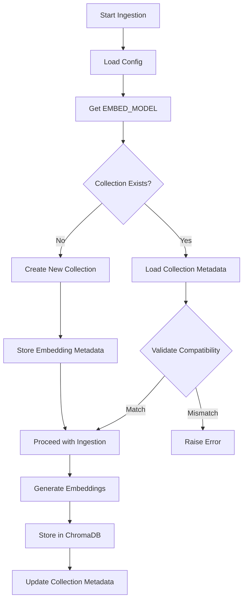
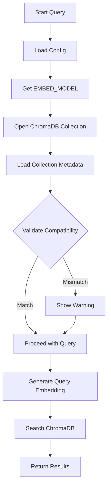

# Embedding Model Safeguards Documentation

**Version:** 1.0.0
**Date:** 2025-12-27
**Status:** ✅ Implemented

---

## Executive Summary

This document describes the embedding model safeguards implemented to prevent the critical data corruption issue that occurs when different embedding models are used for the same ChromaDB collection.

### The Problem

The Cortex Suite uses hardware-based auto-detection to select optimal embedding models:
- **With NVIDIA GPU**: `nvidia/NV-Embed-v2` (1536 dimensions)
- **Without GPU**: `BAAI/bge-base-en-v1.5` (768 dimensions)

This created a critical vulnerability:
1. User ingests documents on machine with GPU → Uses NV-Embed-v2 (1536D)
2. User moves to machine without GPU → Auto-switches to BGE (768D)
3. User ingests more documents → Mixed embeddings in same collection
4. **Result**: Search returns incorrect results, no error message

### The Solution

We've implemented a comprehensive 4-layer safeguard system:

1. **Metadata Storage**: Collections now track which embedding model was used
2. **Validation**: Ingestion and query operations validate model compatibility
3. **Inspection Tools**: Utilities to diagnose existing databases
4. **Migration Tools**: Safe re-embedding with different models

---

## Implementation Details

### 1. Collection Metadata Storage

**File**: `cortex_engine/collection_manager.py`

Collections now store embedding model metadata:

```python
{
    "name": "default",
    "doc_ids": [...],
    "embedding_model": "nvidia/NV-Embed-v2",
    "embedding_dimension": 1536,
    "created_at": "2025-12-27T10:00:00",
    "modified_at": "2025-12-27T10:00:00"
}
```

**New Methods:**
- `set_embedding_model_metadata()`: Store/update model info
- `get_embedding_model_metadata()`: Retrieve model info
- `create_collection()`: Now accepts embedding model parameters

### 2. Embedding Model Validator

**File**: `cortex_engine/utils/embedding_validator.py`

Core validation module that:
- Validates current model matches collection's model
- Gets embedding dimensions for any model
- Provides detailed validation results

**Key Functions:**
```python
# Validate compatibility
result = validate_embedding_compatibility(
    collection_metadata,
    current_model="nvidia/NV-Embed-v2",
    strict=True  # Raise exception on mismatch
)

# Get embedding dimension
dimension = get_embedding_dimension("nvidia/NV-Embed-v2")  # Returns 1536
```

**Exception:**
```python
class EmbeddingModelMismatchError(Exception):
    """Raised when embedding models don't match"""
    def __init__(self, message, current_model, expected_model):
        ...
```

### 3. Ingestion Validation

**File**: `cortex_engine/ingest_cortex.py`

Before ingesting documents:
1. Check if collection exists
2. Load collection metadata
3. Validate current model matches stored model
4. **If mismatch**: Raise error with clear instructions
5. **If new collection**: Store embedding model metadata

**Error Message Example:**
```
❌ CRITICAL: Embedding model mismatch!
   Collection uses: BAAI/bge-base-en-v1.5
   Current system uses: nvidia/NV-Embed-v2

   SOLUTION:
   1. Set CORTEX_EMBED_MODEL environment variable to lock model
   2. Or delete database and re-ingest with current model
```

### 4. Query Validation

**File**: `pages/3_Knowledge_Search.py`

Before executing queries:
1. Load collection metadata
2. Validate model compatibility (non-strict mode)
3. **If mismatch**: Display warnings in UI
4. Continue with query (degraded results, but no crash)

**Warning Example:**
```
⚠️ Embedding model mismatch detected! Search results may be unreliable.
💡 Solution: Set CORTEX_EMBED_MODEL environment variable or delete database
```

### 5. UI Status Display

**File**: `pages/7_Maintenance.py`

New "Embedding Model Status" section shows:
- Current embedding model
- Whether model is locked (environment variable) or auto-detected
- Embedding dimension
- Collection's stored model
- Compatibility status
- Solutions if mismatch detected

**Status Display:**
```
🤖 Embedding Model Status

Current Model: nvidia/NV-Embed-v2
🔒 Environment Variable (locked)

Embedding Dimension: 1536D

Collection Metadata:
Stored Model: nvidia/NV-Embed-v2 (1536D)

✅ Embedding model is compatible
```

---

## Tools & Utilities

### Collection Inspector

**File**: `scripts/embedding_inspector.py`

Diagnoses embedding model issues in existing databases.

**Usage:**
```bash
# Basic inspection
python scripts/embedding_inspector.py

# Detailed analysis
python scripts/embedding_inspector.py --detailed

# Custom database path
python scripts/embedding_inspector.py --db-path /custom/path

# JSON output
python scripts/embedding_inspector.py --json
```

**Output Example:**
```
================================================================================
CORTEX SUITE - EMBEDDING MODEL INSPECTION REPORT
================================================================================

📍 Database Path: /mnt/f/ai_databases/knowledge_hub_db
🤖 Current Model: nvidia/NV-Embed-v2
📊 Current Dimension: 1536

🚨 HEALTH STATUS: CRITICAL - IMMEDIATE ACTION REQUIRED

--------------------------------------------------------------------------------
COLLECTION DETAILS
--------------------------------------------------------------------------------

[1] Collection: knowledge_hub
    Status: CRITICAL_MIXED_DIMENSIONS
    Documents: 1,500
    ⚠️  MIXED DIMENSIONS: [768, 1536]
    Distribution: {768: 500, 1536: 1000}

================================================================================
RECOMMENDATIONS
================================================================================

🚨 CRITICAL ISSUES DETECTED

Your database contains MIXED EMBEDDING DIMENSIONS...

IMMEDIATE ACTION REQUIRED:
1. Backup your source documents
2. Use the database delete function in Maintenance page
3. Re-ingest all documents with a single embedding model
4. Set CORTEX_EMBED_MODEL environment variable to lock your model choice
```

**Exit Codes:**
- `0`: Healthy or no issues
- `1`: Warnings detected
- `2`: Critical issues detected
- `3`: Inspection failed

### Embedding Migrator

**File**: `scripts/embedding_migrator.py`

Safely migrates collections from one embedding model to another.

**Usage:**
```bash
# Migrate to nvidia/NV-Embed-v2
python scripts/embedding_migrator.py --target-model nvidia/NV-Embed-v2

# Migrate with auto-detected source
python scripts/embedding_migrator.py --target-model BAAI/bge-base-en-v1.5 --source-model nvidia/NV-Embed-v2

# Dry run (preview only)
python scripts/embedding_migrator.py --target-model nvidia/NV-Embed-v2 --dry-run

# Skip backup (not recommended)
python scripts/embedding_migrator.py --target-model nvidia/NV-Embed-v2 --no-backup

# Custom database path
python scripts/embedding_migrator.py --db-path /custom/path --target-model nvidia/NV-Embed-v2
```

**Migration Process:**
1. Validates source and target models
2. Creates automatic backup (unless `--no-backup`)
3. Extracts all documents and metadata
4. Deletes old collection
5. Creates new collection
6. Re-embeds all documents with target model
7. Updates collection metadata

**Example Output:**
```
================================================================================
EMBEDDING MODEL MIGRATION
================================================================================
Database: /mnt/f/ai_databases/knowledge_hub_db
Target Model: nvidia/NV-Embed-v2
Dry Run: False

📊 Collection 'knowledge_hub': 1,500 documents
📥 Source Model: BAAI/bge-base-en-v1.5

💾 Creating backup...
✅ Backup created: /mnt/f/ai_databases/backup_20251227_100000

📤 Extracting documents from collection...
✅ Extracted 1,500 documents

🔧 Configuring target model: nvidia/NV-Embed-v2
🗑️  Deleting old collection...
✅ Deleted collection 'knowledge_hub'
➕ Creating new collection with nvidia/NV-Embed-v2...
✅ Created new collection

🔄 Re-embedding documents...
   Progress: 500/1,500 (33.3%)
   Progress: 1,000/1,500 (66.7%)
   Progress: 1,500/1,500 (100.0%)

✅ Updated collection metadata: nvidia/NV-Embed-v2 (1536D)

================================================================================
MIGRATION COMPLETE
================================================================================
✅ Successfully migrated 1,500 documents
📊 New embedding model: nvidia/NV-Embed-v2
```

---

## Best Practices

### 1. Lock Your Embedding Model

**Always** set the `CORTEX_EMBED_MODEL` environment variable to prevent auto-switching:

**Linux/WSL/macOS:**
```bash
export CORTEX_EMBED_MODEL="nvidia/NV-Embed-v2"
```

**Windows PowerShell:**
```powershell
$env:CORTEX_EMBED_MODEL="nvidia/NV-Embed-v2"
```

**Docker Compose:**
```yaml
environment:
  - CORTEX_EMBED_MODEL=nvidia/NV-Embed-v2
```

**Verify:**
```python
from cortex_engine.config import EMBED_MODEL
print(f"Current model: {EMBED_MODEL}")
```

### 2. Choose the Right Model

**Use NV-Embed-v2 if:**
- ✅ You have a persistent NVIDIA GPU
- ✅ You need best quality embeddings
- ✅ You won't move the database between machines

**Use BGE-base if:**
- ✅ You don't have a GPU
- ✅ You need portability
- ✅ You'll access database from multiple environments

### 3. Regular Health Checks

Run the inspector periodically:

```bash
# Quick health check
python scripts/embedding_inspector.py

# Detailed analysis monthly
python scripts/embedding_inspector.py --detailed
```

### 4. Before Major Changes

Always run inspector before:
- Moving database to different machine
- Upgrading hardware
- Changing Docker configurations
- Switching between WSL and native environments

---

## Troubleshooting

### Issue: "Embedding model mismatch prevents ingestion"

**Cause:** Current model doesn't match collection's model

**Solution 1 - Lock to Collection's Model:**
```bash
export CORTEX_EMBED_MODEL="<collection_model>"
# Then retry ingestion
```

**Solution 2 - Delete and Re-ingest:**
1. Go to Maintenance page
2. Use "Delete Knowledge Base" function
3. Re-ingest with current model

**Solution 3 - Migrate:**
```bash
python scripts/embedding_migrator.py --target-model <current_model>
```

### Issue: "Search results seem incorrect"

**Diagnosis:**
```bash
python scripts/embedding_inspector.py
```

**If mixed dimensions detected:**
1. **Critical**: Database is corrupted
2. Must delete and re-ingest OR migrate

**If dimension mismatch (no mixing):**
1. Less critical, but results degraded
2. Lock to correct model OR migrate

### Issue: "No embedding metadata found"

**Cause:** Legacy collection created before metadata tracking

**Solution:**
```bash
# Inspect to identify actual model used
python scripts/embedding_inspector.py --detailed

# Then migrate to lock in the model
python scripts/embedding_migrator.py --target-model <identified_model>
```

---

## Technical Architecture

### Data Flow: Ingestion



### Data Flow: Query



---

## Files Modified

### Core Engine
- ✅ `cortex_engine/collection_manager.py` - Metadata storage
- ✅ `cortex_engine/ingest_cortex.py` - Ingestion validation
- ✅ `cortex_engine/utils/embedding_validator.py` - **NEW** Validation module

### UI Pages
- ✅ `pages/3_Knowledge_Search.py` - Query validation
- ✅ `pages/7_Maintenance.py` - Status display

### Scripts
- ✅ `scripts/embedding_inspector.py` - **NEW** Diagnostic tool
- ✅ `scripts/embedding_migrator.py` - **NEW** Migration utility

### Documentation
- ✅ `docs/EMBEDDING_MODEL_SAFEGUARDS.md` - **NEW** This document

---

## Testing Checklist

### Unit Tests Required
- [ ] `test_embedding_validator.py`
  - [ ] `test_get_embedding_dimension()`
  - [ ] `test_validate_compatibility_match()`
  - [ ] `test_validate_compatibility_mismatch()`
  - [ ] `test_raise_on_strict_mode()`

### Integration Tests Required
- [ ] `test_ingestion_validation.py`
  - [ ] Test ingestion with matching model
  - [ ] Test ingestion blocks on mismatch
  - [ ] Test metadata storage on new collection

- [ ] `test_query_validation.py`
  - [ ] Test query with matching model
  - [ ] Test warning display on mismatch
  - [ ] Test graceful degradation

### Manual Testing Required
- [ ] Fresh installation test
- [ ] Migration test (BGE → NV-Embed)
- [ ] Migration test (NV-Embed → BGE)
- [ ] Inspector on healthy database
- [ ] Inspector on corrupted database
- [ ] UI status display verification

---

## Migration Guide for Existing Users

If you have an existing Cortex Suite installation:

### Step 1: Inspect Your Database
```bash
python scripts/embedding_inspector.py
```

### Step 2A: If Healthy
```bash
# Lock your current model
export CORTEX_EMBED_MODEL="<your_current_model>"
```

### Step 2B: If Mixed Dimensions (Critical)
```bash
# Backup your source documents
# Then delete and re-ingest
# OR contact support for recovery options
```

### Step 2C: If Dimension Mismatch (Warning)
```bash
# Option 1: Lock to collection's model
export CORTEX_EMBED_MODEL="<collection_model>"

# Option 2: Migrate to new model
python scripts/embedding_migrator.py --target-model <new_model>
```

---

## Backward Compatibility

### Legacy Collections
Collections created before this update will:
- ✅ Continue to work
- ⚠️ Show "No embedding metadata found" warning
- ℹ️ Can be upgraded via migration tool

### Environment Variables
- `CORTEX_EMBED_MODEL`: **NEW** - Optional, locks embedding model
- If not set: Falls back to hardware auto-detection (original behavior)

---

## Future Enhancements

### Planned Features
1. **Auto-migration wizard** in UI (click-to-fix)
2. **Collection-level model locking** (multiple collections, different models)
3. **Incremental migration** (migrate in batches to avoid downtime)
4. **Cloud backup integration** before migration

### Under Consideration
1. **Multi-model collections** (experimental, requires research)
2. **Embedding model versioning** (track model version changes)
3. **Performance benchmarks** (NV-Embed vs BGE quality comparison)

---

## Support & Contact

### Questions?
- Open an issue on GitHub
- Check CLAUDE.md for project guidelines
- Review logs in `logs/` directory

### Reporting Bugs
Include:
- Output from `embedding_inspector.py`
- Cortex Suite version
- Hardware configuration (GPU/no GPU)
- Steps to reproduce

---

**Document Version**: 1.0.0
**Last Updated**: 2025-12-27
**Author**: Claude Sonnet 4.5 (via Claude Code)
